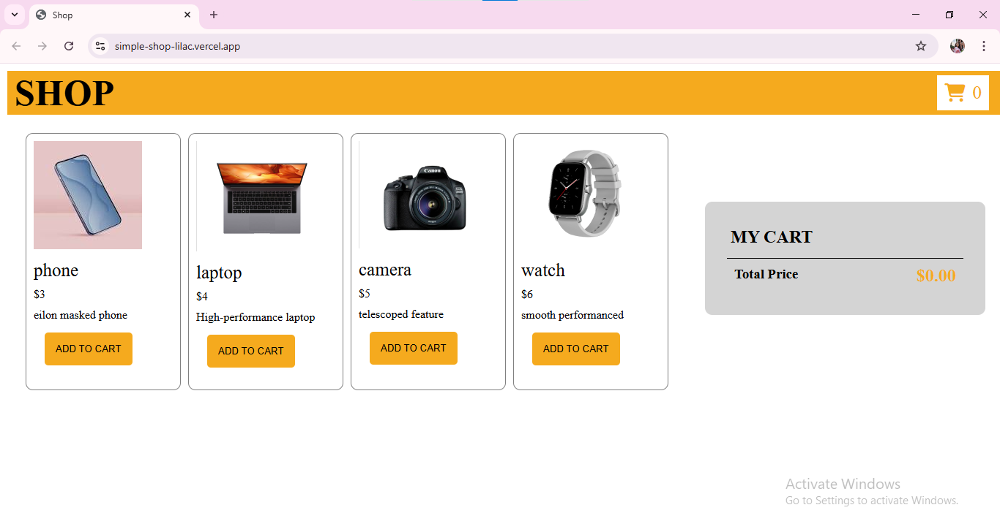
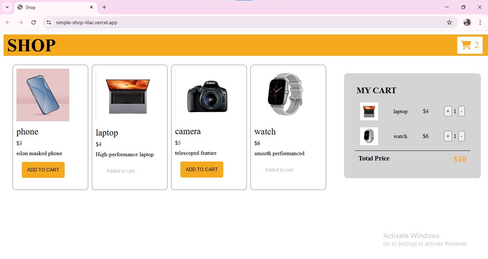
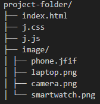

 🛒 Shop - Vanilla JS Shopping Cart

This is a simple and responsive shopping cart web application built using **HTML**, **CSS**, and **vanilla JavaScript**. It showcases core front-end development concepts like DOM manipulation, event handling, and dynamic UI updates — no frameworks, no libraries, just pure code!

> 💡 This was one of my earliest projects and a major stepping stone in my web development journey!

---
## 🚀 Features

- Display of products dynamically from a JS object array
- "Add to Cart" functionality with real-time cart updates
- Quantity control with `+` and `-` buttons
- Dynamic total price calculation
- Responsive and user-friendly layout
- Simple styling with CSS Variables

---
## 🛠 Tech Stack

- **HTML**
- **CSS**
- **JavaScript (ES6)**
- Font Awesome (for icons)

---
## 📸 Screenshots
# simpleShop

## 📂 Folder Structure
